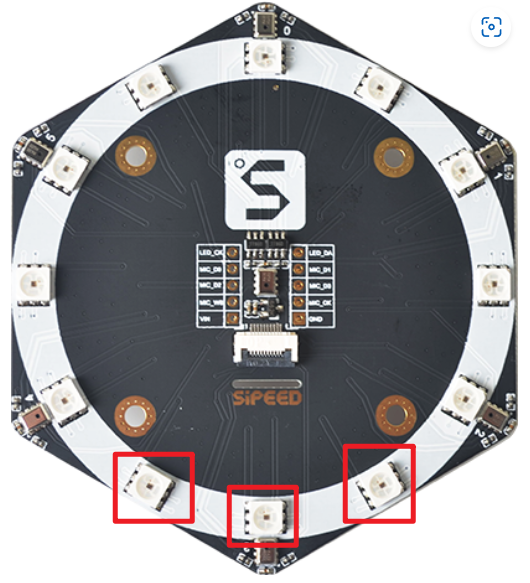
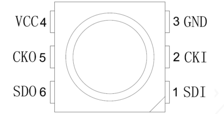
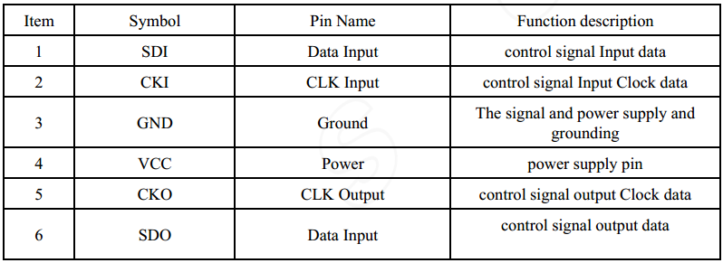
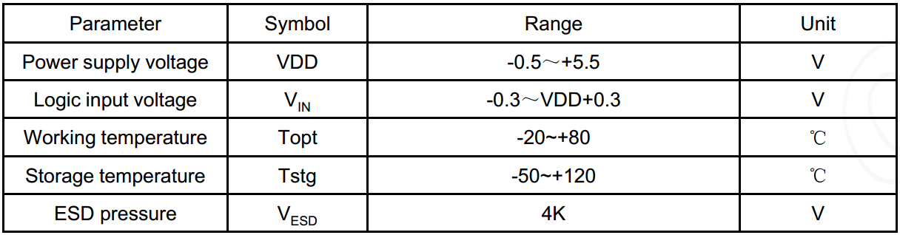
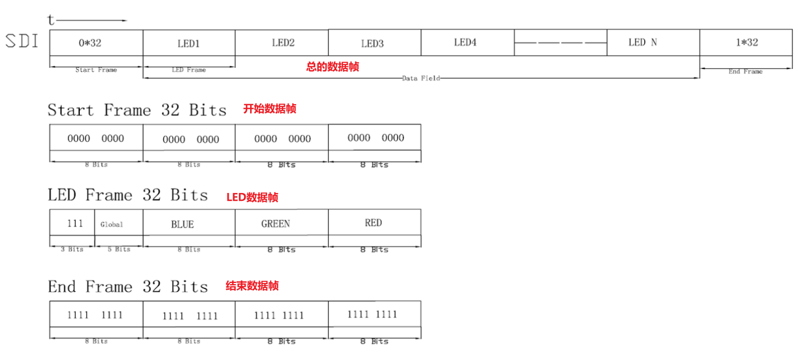

## 一、MicArray 麦克风阵列介绍

1. LED（型号：**SK9822** ）介绍

   阵列板上的 12 颗 LED 可以用来可视化识别声源方位，12颗LED为SK9822采用SPI通信

   

2. 麦克风矩阵（型号：**MSM261S4030H0** ）介绍

   麦克风阵列模块是 Sipeed 基于 MSM261S4030H0 数字麦克风芯片设计的，模块声音识别灵敏度、信噪比高，由沿板的六个麦克风和一个中心的麦克风组成

## 二、SK9822手册说明

1. 引脚定义

   

   

2. 电气参数

   有下图可知SK9822 LED灯使用-0.5-5V供电

   

3. SK9822通信数据帧

   

**具体说明自行查看数据手册**

## 三、驱动代码

